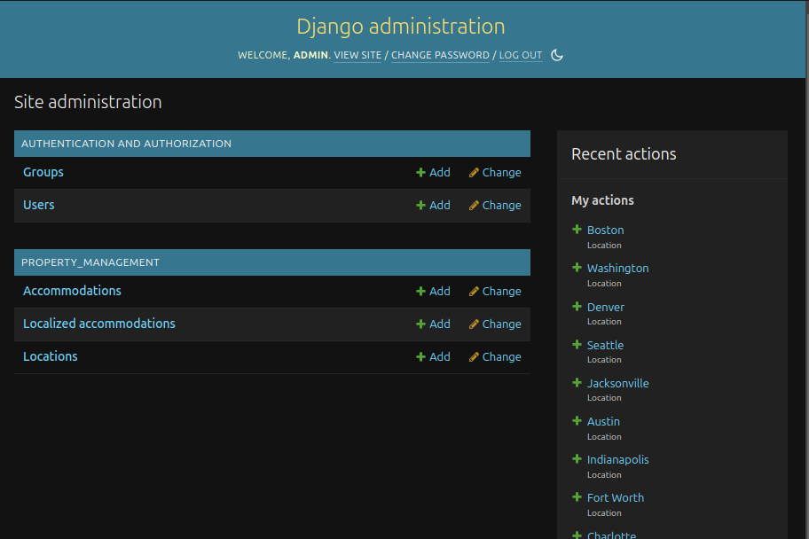
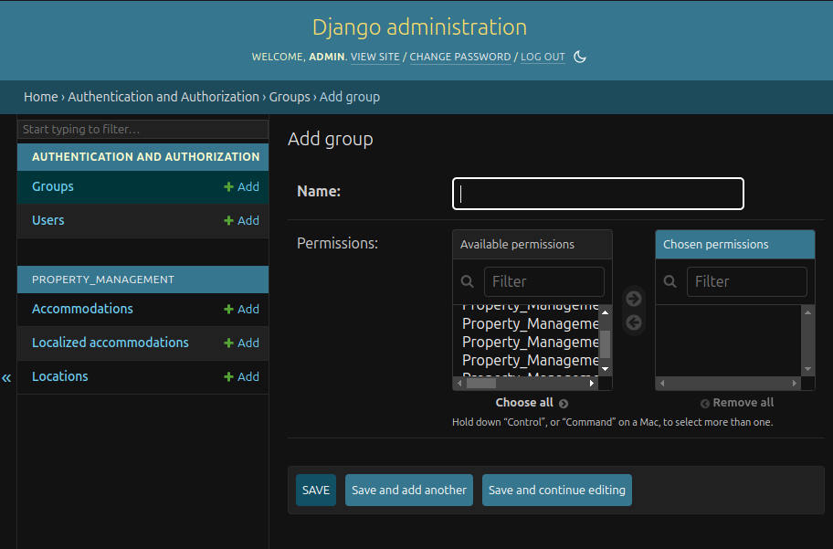
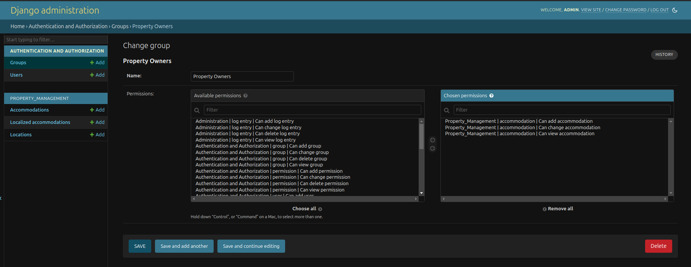
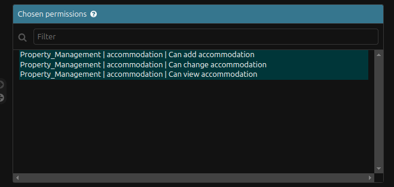
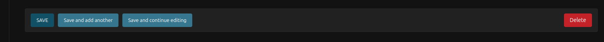
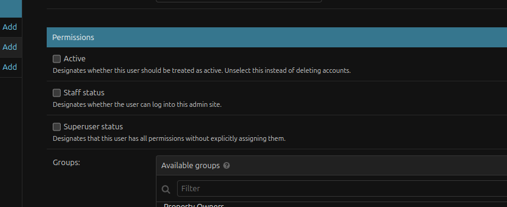

# Property Management System (Inventory Management)

## Overview
This project involves the development of a Property Management System using Django, PostgreSQL, and PostGIS for geospatial data handling. The system allows property owners to manage property information, including locations and accommodations, through a user-friendly Django Admin interface. It supports spatial data for managing locations and offers features such as property listings, user groups, permissions, and the ability to generate a location sitemap.

## Features
- **Django Admin Interface:** Allows easy management of properties and locations.
- **PostGIS Integration:** Enables the use of geospatial data for locations.
- **User Groups and Permissions:** Property Owners can manage their own properties with restricted access.
- **Frontend:** Public-facing sign-up page for property owners.
- **Sitemap Generation:** Command-line utility to generate a `sitemap.json` for country locations.
- **CSV Import:** Ability to import location data via CSV (optional feature).
- **Code Coverage:** Unit tests using `pytest` with over 70% code coverage.

## Project Structure 


📁 inventory/  
├── 📁 mysite/  
│   ├── 📄 __init__.py  
│   ├── 📄 asgi.py  
│   ├── 📄 settings.py  
│   ├── 📄 urls.py  
│   └── 📄 wsgi.py  
│  
├── 📁 property_management/  
│   ├── 📁 management/  
│   │   └── 📁 commands/  
│   │       └── 📄 generate_sitemap.py  
│   │  
│   ├── 📁 migrations/  
│   │  
│   ├── 📁 static/  
│   │  
│   ├── 📁 templates/  
│   │   ├── 📄 signup.html  
│   │   └── 📄 success.html  
│   │  
│   ├── 📁 tests/  
│   │   ├── 📄 __init__.py  
│   │   ├── 📄 test_admin.py  
│   │   ├── 📄 test_models.py  
│   │   └── 📄 test_views.py  
│   │
│   ├── 📄 __init__.py  
│   ├── 📄 admin.py  
│   ├── 📄 apps.py  
│   ├── 📄 forms.py  
│   ├── 📄 models.py  
│   ├── 📄 urls.py  
│   └── 📄 views.py  
│  
├── 📄 .gitignore  
├── 📄 docker-compose.yml  
├── 📄 Dockerfile  
├── 📄 manage.py  
├── 📄 requirements.txt  
├── 📄 README.md  
└── 📄 pytest.ini  


## Setup and Run Instructions

### Prerequisites
- Python 3.7 or higher
- Docker
- Docker Compose


### Installation

#### Clone the project repository

```
https://github.com/uzzalcse/inventory.git
```

#### Go to the project directory 

```
cd inventory

```

#### Creating virtual environment 

```
python3 -m venv venv

```
#### If the previous (for creating virtual environment) command does not work 

```
python -m venv venv

```

#### Go to the virtual environment
##### In Windows
```
venv\Scripts\activate

```

###### In Mac/Linux

```
source venv/bin/activate

```

#### Now build the project

```
docker compose build

```
#### Run the project


```
docker compose up -d

```
#### Make migration and migrate 

```
docker exec -it inventory_app python manage.py makemigrations
docker exec -it inventory_app python manage.py migrate
```
#### Create a super user(After running the commands follow on screen instructions)

```
docker exec -it inventory_app python manage.py createsuperuser

```

#### Now log in to the super user 

http://127.0.0.1:8000/

Provide the username and password which you have created in the previous part  

You will the the following screen 

  

Now Click `+Add` button beside Groups. Then you will see the following screen   


In Name type 'Propery Owners'.




From the availabe permissions select the following permissions

  
Then click the save button. Now project is ready.




From the django admin now you can import locations from csv. 

Click the locations menu. And you will be able to see the import button at the top right side of the window. Click that and select csv as a file type and import a csv file from your file system. 

The data in csv file will be like the following 

```
id,title,location_type,country_code,state_abbr,city,center
1,San Francisco,City,US,CA,San Francisco,"POINT(-122.4194 37.7749)"
2,New York,City,US,NY,New York,"POINT(-74.0060 40.7128)"
3,Los Angeles,City,US,CA,Los Angeles,"POINT(-118.2437 34.0522)"
4,Chicago,City,US,IL,Chicago,"POINT(-87.6298 41.8781)"
5,Houston,City,US,TX,Houston,"POINT(-95.3698 29.7604)"

```

Create a csv file with the above contents and try import that. You will find a `locations.csv` in your root directory. You can try with that.


### Public facing sign up 

Go to the following link and signup following on screen reequirements

http://127.0.0.1:8000/signup/

After successfully signing up you will redirect to the succes page. where you will see a login option. But you will not be able to login. Because the admin needs to permit you to login. 

### Giving permission for login 

First you log in as a super user. then go to users. 




Select 'Active' and 'Staff status' and save. 

After doing this the user will be able to login and manage their own property. 


### Generating site map. Run the following command. You will see a `sitemap.json` file in your project root directory.

```
docker-compose exec web python manage.py generate_sitemap

```
### Testing 

For testing with code coverage run the following commandd.

```
docker-compose exec web pytest --cov=property_management 
```

### Stopping the project

```
docker compose down

```